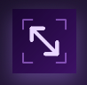

#  Glide

A simple utility that Adds easy `modifier key + mouse drag` move and resize capabilities to MacOS

## Description

**Glide** focuses on one thing: simple, reliable window movement and resizing.

There are many powerful window manager utilities for MacOS to be found in the AppStore. However, over time they have become bloated with ton of options. Glide stays laser beam focused on allowing you to drag and resize app windows with the minimal effort using your keys and mouse.

* Hold `Cmd + Shift` and drag any window under your cursor to move it
* Hold `Cmd + Shift` and drag with **Right Mouse** anywhere in a window to resize it
  * Where you right-click controls the resize direction (for example, near the top-right resizes from the top-right corner)

### Customization

You can customize which modifier keys are required from the menu bar dropdown. **All** selected modifier keys must be held down at the same time for drag or resize to activate.

* `Disabled` - turns Glide on/off globally (when disabled, move/resize actions are ignored)
* `Alt`, `Cmd`, `Ctrl`, `Shift` - toggle required modifier keys
* `Hover move` - when enabled, you can drag a window by pressing your hot keys and simply moving your mouse. The application under the mouse is dragged, without having to click no the title bar or left click
* `Reset to Defaults` - restores defaults (`Cmd + Shift` and `Hover move` enabled)
* `Exit` - quits Glide

## Installation

* Grab the latest version from the [Releases page](https://github.com/drluckyspin/glide/releases)
* Open the DMG and **drag Glide to Applications** (do not run directly from the disk image)
* Launch Glide from Applications
* Enable Privacy Settings during onboarding

  

* Click the menu icon for the dropdown to change hot keys

  

## Developing

### Quick start

* Clone the repo, then open the project with `make open` (or open `Glide.xcodeproj` in Xcode)
* If you have not developed with Xcode before `xcodebuild -runFirstLaunch`
* Build from Terminal with `make build` (or `make build-debug`)
* Run tests with `make test`
* Run the built app with `make run`
* Clean local build output with `make clean`
* Install your current version into /Applications `make install`
* Package up a version for testing `make package`

Full details of the [Release Process](RELEASE.md).

### Xcode and dependency requirements

* Xcode with macOS SDK support (project `LastUpgradeCheck` is `2630`)
* macOS deployment target is `13.0`
* Swift language version is `5.0`
* Uses Apple frameworks only (`Cocoa`, `SwiftUI`, `XCTest`) and Accessibility APIs
* No third-party package dependencies (no SwiftPM/CocoaPods/Carthage required)
* **Brew tools** (for `make package` / `make release`): `create-dmg` — install with `brew install create-dmg`
* Run `make check` to verify all dependencies (Xcode, brew, create-dmg)
* Automate package release and build with a GH runner

## Roadmap

* Add support for registering to start automatically at startup
* Enable users to select their own color scheme
* Add an About dialog with version
* Add "check for updates" functionality

## Contributing

Contributions are welcome and appreciated.

* Open an issue first for bugs or feature ideas (details help).
* For code changes, use the standard fork -> branch -> pull request workflow.
* Small or WIP pull requests are great for early feedback.
