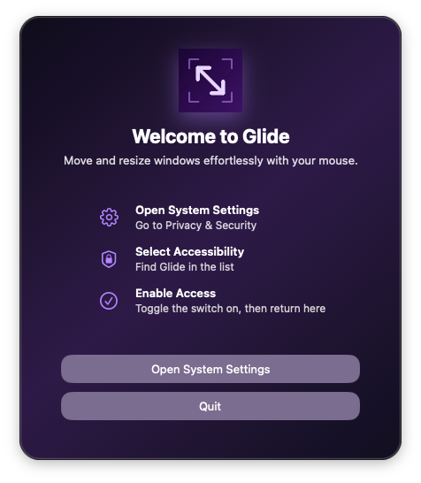
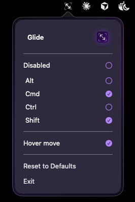

#  Glide

Adds easy `modifier key + mouse drag` move and resize to OSX

## Description

**Glide** focuses on one thing: simple, reliable window movement and resizing.

Inspired by the clean workflow in many X11/Linux window managers, Glide keeps the core behavior while avoiding bloated settings and overkill options.

* Hold `Cmd + Shift` and drag any window under your cursor to move it.
* Hold `Cmd + Shift` and drag with **Right Mouse** anywhere in a window to resize it.
  * Resize direction depends on where you right-click in the window (for example, clicking near the top-left behaves like dragging the top-left corner).
* You can customize which modifier keys are required from the menu bar dropdown:
  * click a key to toggle it on or off
  * all selected keys must be held for move/resize to activate
  * choose `Reset to Defaults` to return to `Cmd + Shift`
* You can disable the behavior entirely with the `Disabled` menu item.

## Installation

* Grab the latest version from the [Releases page](https://github.com/drluckyspin/glide/releases)
* Unzip and run!
* Enable Privacy Settings during onboarding

  

* Click the menu icon for the dropdown to change hot keys

  

## Contributing

Contributions are welcome and appreciated.

* Open an issue first for bugs or feature ideas (details help).
* For code changes, use the standard fork -> branch -> pull request workflow.
* Small or WIP pull requests are great for early feedback.
