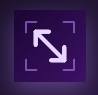
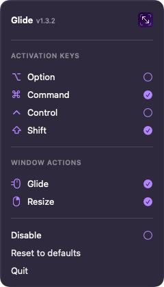
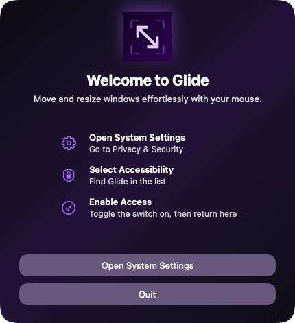

#  Glide

A simple utility that adds easy `modifier key + mouse drag` move and resize capabilities to macOS

## Description

**Glide** focuses on one thing: simple, reliable window movement and resizing.

There are many powerful window manager utilities for macOS. However, over time they have become bloated with a ton of
options. Glide stays laser beam focused on allowing you to drag and resize app windows with the minimal effort using
your keys and mouse.

- Hold `Cmd + Shift` and drag any window under your cursor to move it
- Hold `Cmd + Shift` and drag with **Right Mouse** anywhere in a window to resize it
  - Where you right-click controls the resize direction (for example, near the top-right resizes from the top-right
    corner)

### Customization

You can customize which modifier keys are required from the menu bar dropdown. **All** selected modifier keys must be
held down at the same time for drag or resize to activate.

- `Disabled` - turns Glide on/off globally (when disabled, move/resize actions are ignored)
- `Alt`, `Cmd`, `Ctrl`, `Shift` - toggle required modifier keys
- `Hover move` - when enabled, you can drag a window by pressing your hot keys and simply moving your mouse. The
  application under the mouse is dragged, without having to click no the title bar or left click
- `Reset to Defaults` - restores defaults (`Cmd + Shift` and `Hover move` enabled)
- `Exit` - quits Glide

## Installation

Glide is distributed as a **signed, notarized DMG** via
[GitHub Releases](https://github.com/drluckyspin/glide/releases). The
[landing site](https://github.com/drluckyspin/glide/tree/main/site) download button points at the same release zip.

- Download the latest `Glide-{version}.zip` from the [Releases page](https://github.com/drluckyspin/glide/releases)
- Unzip `Glide-{version}.zip`, then open the extracted DMG and **drag Glide to Applications** (do not run directly from the disk image)
- Launch Glide from Applications
- Enable Privacy Settings during onboarding

  

- Click the menu icon for the dropdown to change hot keys

  

## Developing

### Quick start

- Clone the repo, then open the project with `make open` (or open `Glide.xcodeproj` in Xcode)
- If you have not developed with Xcode before `xcodebuild -runFirstLaunch`
- Build from Terminal with `make build` (or `make build-debug`)
- Run tests with `make test`
- Run the built app with `make run`
- Clean local build output with `make clean`
- Regenerate README/site screenshots after a version bump with `make screenshots` (macOS only)
- Install your current version into /Applications `make install`
- Package up a version for testing `make dev-package` (unsigned DMG, no notarization)
- Build a signed + notarized DMG for distribution with `make release` (see notes below)

Full details of the [Release Process](RELEASE.md).

#### Releasing locally

`make release` codesigns and notarizes a distributable DMG. It signs with the Developer ID Application identity in your
**login keychain** and notarizes using credentials from `secrets/secrets.env` — it does not create or switch keychains,
so it won't disturb your macOS session.

> **Note:** Your Developer ID Application certificate must be installed in your login keychain. If it isn't,
> `make release` fails with a clear message — import it once by double-clicking `secrets/DevIDCertificates.p12`, then
> retry. Override the identity with `make release SIGN_IDENTITY="Developer ID Application: Your Name (TEAMID)"` if
> needed.

Tagged releases (pushing a `v*` tag) are built and published automatically by GitHub Actions, which signs independently
of this Makefile target.

### Xcode and dependency requirements

- Xcode with macOS SDK support (project `LastUpgradeCheck` is `2630`)
- macOS deployment target is `13.0`
- Swift language version is `5.0`
- Uses Apple frameworks only (`Cocoa`, `SwiftUI`, `XCTest`) and Accessibility APIs
- No third-party package dependencies (no SwiftPM/CocoaPods/Carthage required)
- **Brew tools** (for `make dev-package` / `make release`): `create-dmg` — install with `brew install create-dmg`
- Run `make check` to verify all dependencies (Xcode, brew, create-dmg)
- Automate package release and build with a GH runner

## Roadmap

- Add support for registering to start automatically at startup
- Enable users to select their own color scheme
- Add an About dialog with version
- Add "check for updates" functionality

## Contributing

Contributions are welcome and appreciated.

- Open an issue first for bugs or feature ideas (details help).
- For code changes, use the standard fork -> branch -> pull request workflow.
- Small or WIP pull requests are great for early feedback.
